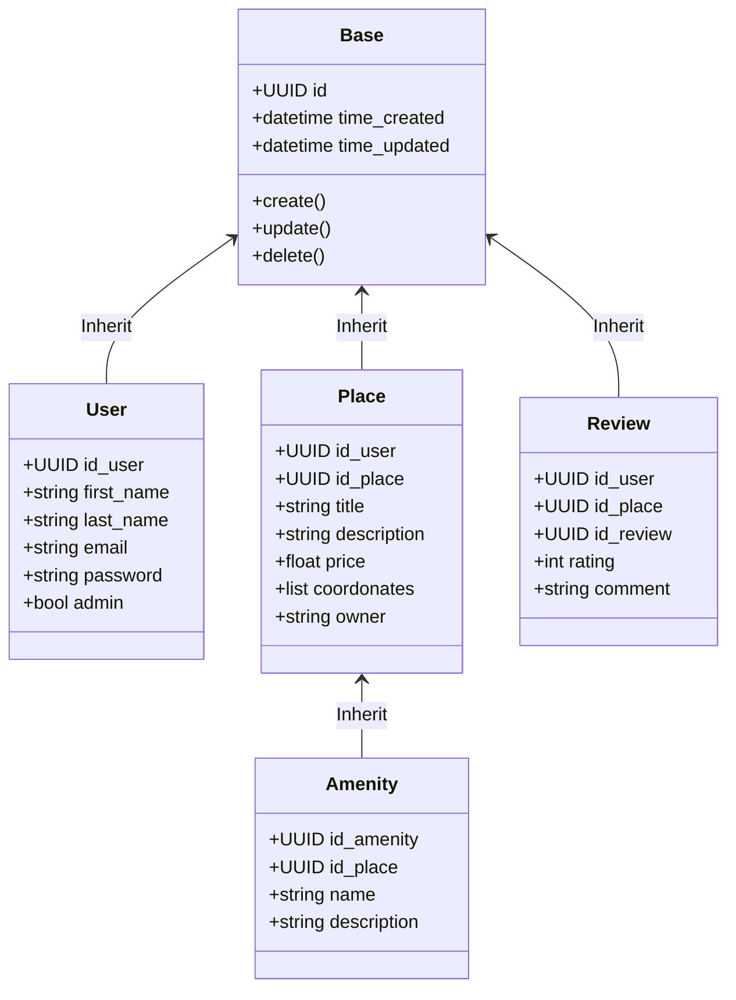

## Business Logic Class Diagram

```mermaid
classDiagram
direction TB
    class Base {
      +UUID id
      +datetime time_created
      +datetime time_updated
	    +create()
	    +update()
	    +delete()
    }

    class User {
	    +UUID id_user
	    +string first_name
	    +string last_name
	    +string email
	    +string password
	    +bool admin
    }

    class Place {
      +UUID id_user
      +UUID id_place
	    +string title
	    +string description
	    +float price
	    +list coordonates
	    +string owner
    }

    class Review {
      +UUID id_user
      +UUID id_place
      +UUID id_review
	    +int rating
	    +string comment
    }

    class Amenity {
      +UUID id_amenity
      +UUID id_place
	    +string name
	    +string description
    }

    Base <-- User : Inherit
    Base <-- Place : Inherit
    Base <-- Review : Inherit
    Place <-- Amenity : Inherit
```
