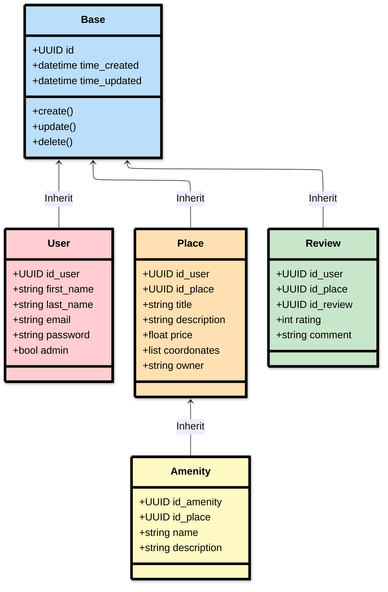

## Business Logic Class Diagram

```mermaid
---
config:
  theme: default
  look: neo
  layout: elk
---
classDiagram
direction TB
    class Base {
	    +UUID id
	    +datetime time_created
	    +datetime time_updated
	    +create()
	    +update()
	    +delete()
    }
    class User {
	    +UUID id_user
	    +string first_name
	    +string last_name
	    +string email
	    +string password
	    +bool admin
    }
    class Place {
	    +UUID id_user
	    +UUID id_place
	    +string title
	    +string description
	    +float price
	    +list coordonates
	    +string owner
    }
    class Review {
	    +UUID id_user
	    +UUID id_place
	    +UUID id_review
	    +int rating
	    +string comment
    }
    class Amenity {
	    +UUID id_amenity
	    +UUID id_place
	    +string name
	    +string description
    }

    Base <-- User : Inherit
    Base <-- Place : Inherit
    Base <-- Review : Inherit
    Place <-- Amenity : Inherit

	class Base:::Class_02
	class Base:::Ash
	class Base:::Class_03
	class User:::Rose
	class User:::Class_02
	class Place:::Peach
	class Place:::Class_01
	class Review:::Aqua
	class Review:::Class_01
	class Review:::Class_04
	class Amenity:::Class_05

	classDef Rose :,stroke-width:1px, stroke-dasharray:none, stroke:#FF5978, fill:#FFDFE5, color:#8E2236
	classDef Peach :,stroke-width:1px, stroke-dasharray:none, stroke:#FBB35A, fill:#FFEFDB, color:#8F632D
	classDef Aqua :,stroke-width:1px, stroke-dasharray:none, stroke:#46EDC8, fill:#DEFFF8, color:#378E7A
	classDef Ash :,stroke-width:1px, stroke-dasharray:none, stroke:#999999, fill:#EEEEEE, color:#000000
	classDef Class_02 :, stroke-width:4px, stroke-dasharray: 0, fill:#FFCDD2, color:#000000, stroke:#000000
	classDef Class_01 :, stroke-width:4px, stroke-dasharray: 0, stroke:#000000, fill:#FFE0B2, color:#000000
	classDef Class_03 :, stroke-width:4px, stroke-dasharray: 0, fill:#BBDEFB, color:#000000, stroke:#000000
	classDef Class_04 :,stroke-width:4px, stroke-dasharray: 0, stroke:#000000, fill:#C8E6C9, color:#000000
	classDef Class_05 :,stroke-width:4px, stroke-dasharray: 0, stroke:#000000, fill:#FFF9C4, color:#000000
```
